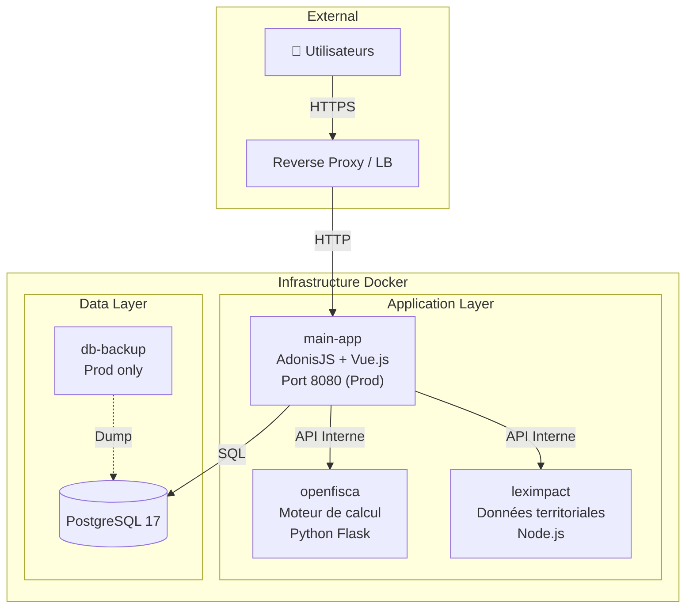

# Infrastructure & Architecture

Ce document détaille l'infrastructure Docker, l'architecture des services et les procédures de déploiement de l'application **Aides Simplifiées**.

## 🏗️ Architecture Globale

L'application repose sur une architecture micro-services orchestrée par Docker Compose.



### Services

| Service | Technologie | Description |
|---------|-------------|-------------|
| **main-app** | AdonisJS + Vue.js | Application principale, serveur web, API, frontend (Inertia). |
| **openfisca** | Python / Flask | [OpenFisca France](https://github.com/openfisca/openfisca-france). Moteur de calcul législatif. |
| **leximpact** | Node.js | [LexImpact Territoires](https://git.leximpact.dev/leximpact/territoires/territoires). API de données géographiques. |
| **db** | PostgreSQL 17 | Base de données relationnelle. |

## 🌍 Environnements

Nous utilisons plusieurs configurations Docker Compose selon le contexte (`infra/docker-compose.*.yml`).

| Env | Usage | Main App | Services Tiers | Ports Exposés |
|-----|-------|----------|----------------|---------------|
| **dev** | Développement quotidien | **Local** (Hôte) | Docker | DB (5432), OpenFisca (5001), LexImpact (3000) |
| **preprod** | Staging / Recette | Docker | Docker | App (8081) |
| **prod** | Production | Docker | Docker | App (8080) |

> ⚠️ **Note :** En développement (`make dev`), l'application principale tourne sur votre machine hôte (via `pnpm dev`) pour le hot-reload, tandis que les dépendances (DB, OpenFisca, etc.) tournent dans Docker.

## 🔧 Configuration

### Variables d'Environnement


La configuration est centralisée à la racine du projet.
- **Développement** : `.env` (pour AdonisJS et Docker dev)
- **Préproduction** : `.env.preprod`
- **Production** : `.env.prod`

Docker Compose est configuré pour utiliser ces fichiers situés à la racine.

Variables clés pour l'infrastructure :

| Variable | Dev (Localhost) | Prod (Docker) |
|----------|-----------------|---------------|
| `DB_HOST` | `localhost` | `db` |
| `OPENFISCA_URL` | `http://localhost:5001/calculate` | `http://openfisca:5000/calculate` |
| `LEXIMPACT_URL` | `http://localhost:3000` | `http://leximpact:3000` |

### Secrets

Pour générer des clés sécurisées (APP_KEY, DB_PASSWORD...) :
```bash
make secrets
```

## 🚀 Déploiement

### Pré-requis Serveur
- Docker & Docker Compose
- Git
- Make

### Procédure d'installation (Production)

1. **Cloner le projet**
   ```bash
   git clone https://github.com/betagouv/aides-simplifiees-app.git
   cd aides-simplifiees-app
   ```

2. **Configurer les environnements**
   ```bash
   # App
   cp .env.template .env
   # Infra
   cp .env.template .env.prod
   # Éditer les fichiers avec les secrets de production
   ```

3. **Initialiser**
   ```bash
   # Création volume DB externe (sécurité)
   docker volume create aides-simplifiees-prod_dbdata_prod

   # Démarrage
   make prod

   # Migrations (si nécessaire)
   make db-migrate ENV=prod
   ```

4. **Maintenance**
   - Logs : `make logs ENV=prod`
   - Backup SQL : `make db-backup ENV=prod`
   - Mise à jour : `git pull && make prod` (le Makefile fait un pull des images)

## 🔒 Sécurité

- **Utilisateur non-privilégié** : Les conteneurs tournent avec `security_opt: no-new-privileges:true`.
- **Read-only** : Le conteneur OpenFisca est en lecture seule.
- **Réseau** : En production, seuls les ports de l'application principale sont exposés. La base de données et les services tiers ne sont accessibles que via le réseau interne Docker.
