# Infrastructure & Architecture

This document details the Docker infrastructure, service architecture, and deployment procedures for the **Aides Simplifiées** application.

## Global Architecture

The application relies on a micro-services architecture orchestrated by Docker Compose.

```mermaid
graph TB
    subgraph "Docker Infrastructure"
        subgraph "Application Layer"
            main["main-app<br/>AdonisJS + Vue.js<br/>Port 8080 (Prod)"]
            openfisca[openfisca<br/>Calculation Engine<br/>Python Flask]
            leximpact[leximpact<br/>Territorial Data<br/>Node.js]
        end

        subgraph "Data Layer"
            db[(PostgreSQL 17)]
            backup[db-backup<br/>Prod only]
        end
    end

    subgraph "External"
        users[👥 Users]
        proxy[Reverse Proxy / LB]
    end

    users -->|HTTPS| proxy
    proxy -->|HTTP| main
    main -->|Internal API| openfisca
    main -->|Internal API| leximpact
    main -->|SQL| db
    backup -.->|Dump| db
```



### Services

| Service | Technology | Description |
|---------|-------------|-------------|
| **main-app** | AdonisJS + Vue.js | Main application, web server, API, frontend (Inertia). |
| **openfisca** | Python / Flask | [OpenFisca France](https://github.com/openfisca/openfisca-france). Legislative calculation engine. |
| **leximpact** | Node.js | [LexImpact Territoires](https://git.leximpact.dev/leximpact/territoires/territoires). Geographic data API. |
| **db** | PostgreSQL 17 | Relational database. |

## Environments

Multiple Docker Compose configurations are used depending on the context (`infra/docker-compose.*.yml`).

| Env | Usage | Main App | Party Services | Exposed Ports |
|-----|-------|----------|----------------|---------------|
| **dev** | Daily Development | **Local** (Host) | Docker | DB (5432), OpenFisca (5001), LexImpact (3000) |
| **preprod** | Staging / QA | Docker | Docker | App (8081) |
| **prod** | Production | Docker | Docker | App (8080) |

> **Note:** In development (`make dev`), the main application runs on the host machine (via `pnpm dev`) for hot-reload, while dependencies (DB, OpenFisca, etc.) run in Docker.

## Configuration

### Environment Variables

Configuration is centralized at the project root.
- **Development**: `.env` (for AdonisJS and Docker dev)
- **Preproduction**: `.env.preprod`
- **Production**: `.env.prod`

Docker Compose is configured to use these files.

Key infrastructure variables:

| Variable | Dev (Localhost) | Prod (Docker) |
|----------|-----------------|---------------|
| `DB_HOST` | `localhost` | `db` |
| `OPENFISCA_URL` | `http://localhost:5001/calculate` | `http://openfisca:5000/calculate` |
| `LEXIMPACT_URL` | `http://localhost:3000` | `http://leximpact:3000` |

### Secrets

To generate secure keys (APP_KEY, DB_PASSWORD...):
```bash
make secrets
```

## Deployment

### Server Prerequisites
- Docker & Docker Compose
- Git
- Make
