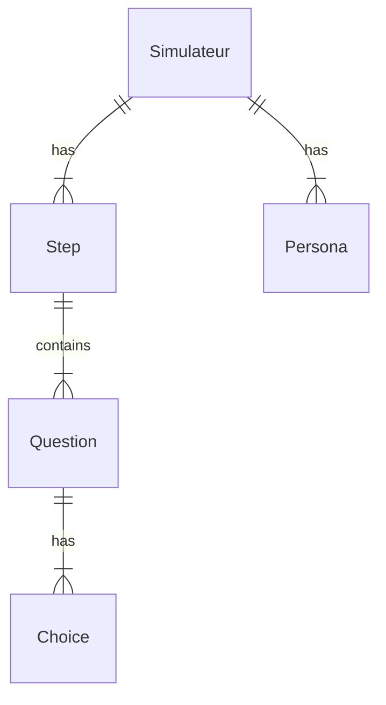
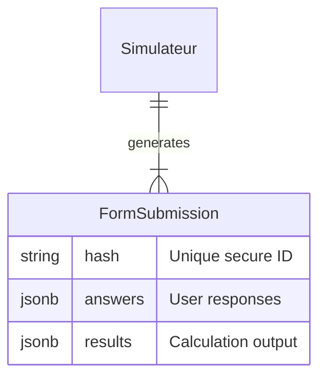
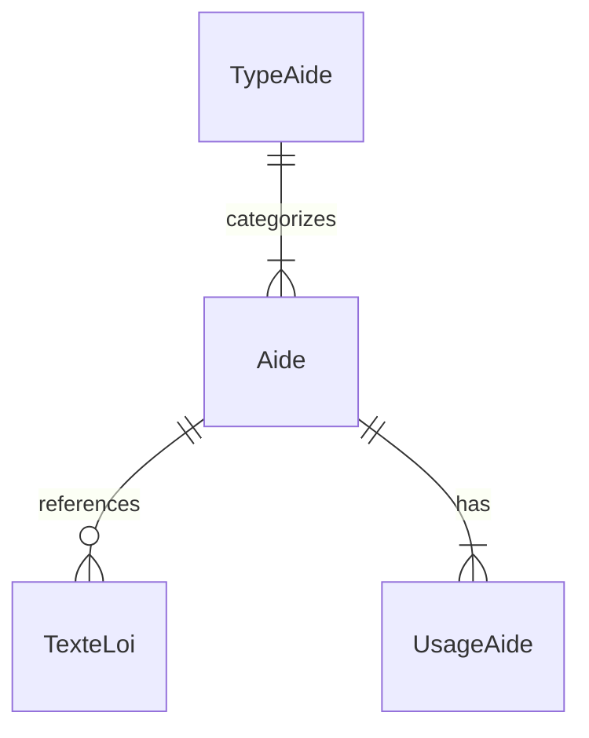

# Database & Data Model

## Overview

The application uses PostgreSQL 17 with Lucid ORM. The schema is hybrid, combining relational structures for configuration with JSONB for flexible data (forms, answers).

## Key Relationships

### Simulator Structure (Traditional Mode)

- **Simulateur**: The root entity.
- **Step/Question/Choice**: Defines the form structure (when not in Publicodes mode).
- **Persona**: Test data sets associated with a simulator.

### Simulation Results

- **FormSubmission**: Stores the *snapshot* of a user's session.
    - `hash`: SHA-256 (or similar) unique identifier used in URLs.
    - `answers`: JSON object mapping Question IDs or Publicodes variables to values.
    - `results`: Cached calculation result to allow sharing without re-computation.

### Aides Catalog

- **TypeAide**: High-level category (e.g., "Prêt", "Subvention").
- **Aide**: The core content entity (Financial Aid).
- **TexteLoi**: Stored as a JSONB array on the Aide model (lightweight relation).

## JSONB Usage

We use `jsonb` columns extensively for flexibility:

1.  **`simulators.built_json`**: Stores the full compiled form structure (questions, steps, logic). This avoids N+1 queries when rendering the form.
2.  **`form_submissions.answers`**: Stores user input. Schema varies per simulator.
3.  **`aides.ds_field_mapping`**: Stores the mapping between simulator questions and Démarches Simplifiées fields.

## Migrations & Seeding

- **Migrations**: Located in `database/migrations/`. 
- **Seeders**: Located in `database/seeders/`. Development seeders populate the database with:
    - Default admin user (`admin@beta.gouv.fr`)
    - Example simulators (Housing, Mobility)
    - Reference Aides content

## Commands

```bash
# Apply migrations
node ace migration:run

# Reset and seed (Dev only)
node ace migration:fresh --seed
```
