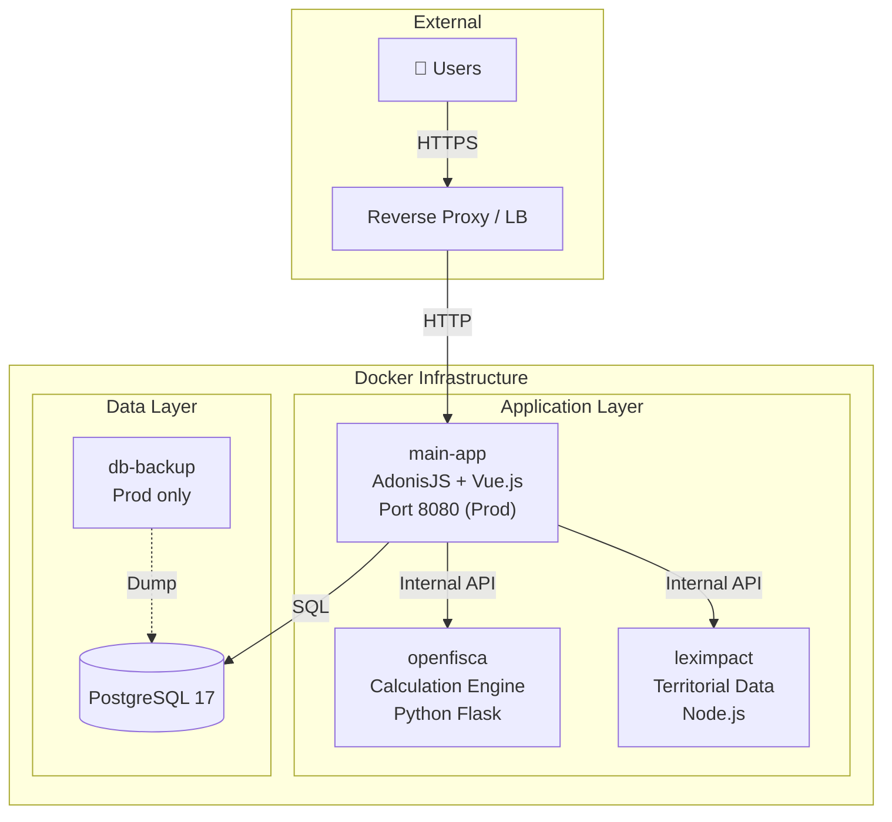

# Infrastructure & Architecture

This document details the Docker infrastructure, service architecture, and deployment procedures for the **Aides Simplifiées** application.

## Global Architecture

The application relies on a micro-services architecture orchestrated by Docker Compose.



### Services

| Service | Technology | Description |
|---------|-------------|-------------|
| **main-app** | AdonisJS + Vue.js | Main application, web server, API, frontend (Inertia). |
| **openfisca** | Python / Flask | [OpenFisca France](https://github.com/openfisca/openfisca-france). Legislative calculation engine. |
| **leximpact** | Node.js | [LexImpact Territoires](https://git.leximpact.dev/leximpact/territoires/territoires). Geographic data API. |
| **db** | PostgreSQL 17 | Relational database. |

## Environments

Multiple Docker Compose configurations are used depending on the context (`infra/docker-compose.*.yml`).

| Env | Usage | Main App | Party Services | Exposed Ports |
|-----|-------|----------|----------------|---------------|
| **dev** | Daily Development | **Local** (Host) | Docker | DB (5432), OpenFisca (5001), LexImpact (3000) |
| **preprod** | Staging / QA | Docker | Docker | App (8081) |
| **prod** | Production | Docker | Docker | App (8080) |

> **Note:** In development (`make dev`), the main application runs on the host machine (via `pnpm dev`) for hot-reload, while dependencies (DB, OpenFisca, etc.) run in Docker.

## Configuration

### Environment Variables

Configuration is centralized at the project root.
- **Development**: `.env` (for AdonisJS and Docker dev)
- **Preproduction**: `.env.preprod`
- **Production**: `.env.prod`

Docker Compose is configured to use these files.

Key infrastructure variables:

| Variable | Dev (Localhost) | Prod (Docker) |
|----------|-----------------|---------------|
| `DB_HOST` | `localhost` | `db` |
| `OPENFISCA_URL` | `http://localhost:5001/calculate` | `http://openfisca:5000/calculate` |
| `LEXIMPACT_URL` | `http://localhost:3000` | `http://leximpact:3000` |

### Secrets

To generate secure keys (APP_KEY, DB_PASSWORD...):
```bash
make secrets
```

## Deployment

### Server Prerequisites
- Docker & Docker Compose
- Git
- Make

## Docker Images

We use specific scripts to build and push multi-architecture images (`amd64` and `arm64`) to the GitHub Container Registry.

### Commands

| Command | Usage | Script Used |
|---------|-------|-------------|
| `make build-main-app-preprod` | Manual build for Preproduction | `infra/scripts/docker-build-app.sh preprod` |
| `make build-main-app-version` | Manual build for Release | `infra/scripts/docker-build-app.sh version` |
| `make build-leximpact` | Build LexImpact service | `infra/scripts/docker-build-leximpact.sh latest` |

### Build Script Strategy

The script `infra/scripts/docker-build-app.sh` handles:
1.  **Multi-Platform Build**: Uses `docker buildx` to target `linux/amd64` and `linux/arm64`.
2.  **Tagging**:
    - `preprod` -> Tags image as `:preprod`.
    - `version` -> Reads `package.json` version, tags as `:x.y.z` AND `:latest`.
3.  **Registry**: Pushes to `ghcr.io/betagouv/aides-simplifiees-app`.

### CI/CD Integration

These commands can be used in GitHub Actions workflows to automatically build and push images upon meaningful events (push to main, release creation).
